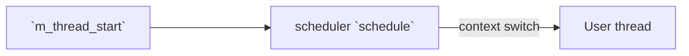
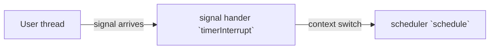
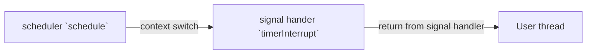
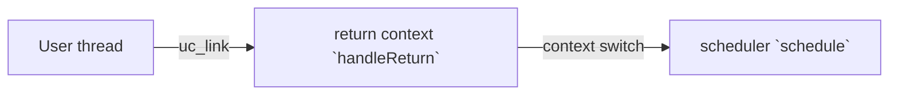

# `m_thread`
A simple M:1 preemptive thread implementation

'M' means multiple user created thread, '1' means one system thread. `m_thread` multiplexes single system thread to 
run multiple user created threads concurrently.

`m_thread` is not multi-thread(pthread) safe, it shall be run in single system thread only 

## Usage
- `#include "m_thread.h"`
- First, use `m_thread_create()` to create a thread, at this point the thread won't start automatically
- After all the threads are created, call `m_thread_start()` to start the scheduler. This function will block until all 
threads return
- Threads are allowed to call `m_thread_create()` to add new threads during the execution, new threads will be executed
later automatically
- Threads can call `m_thread_yield()` if they want to give up the CPU
- Threads can call `m_thread_self()` to get its thread id, just like `pthread_self()`
- Sleep-related actions shall be done via `m_thread_sleep()` and `m_thread_usleep()`
- Threads are not allowed to use async signal safe functions (e.g. `malloc()`, `printf()`), or you pay the cost.
- You can use `async_signal_safe(x)` to make expression `x` async signal safe
- To make function calls to a specific function async signal safe (e.g. `printf()`): `#define printf(...) async_signal_safe(printf(__VA_ARGS__))`

## Examples
- `main`: `make main` : simple presentation
- `pingpong`: `make pingpong` : two threads communicate with each other by `pipe()`
- `produce_consume`: `make produce_consume` : multiple producer threads communicate with multiple consumer threads randomly

## How it works
`m_thread` is implemented by utilizing functions in `ucontext.h` to perform context switch (which are NOT async signal 
safe, see descriptions below), `sigaction` to install signal handler, and using `timer_settime` to generate a 
periodical signal. 

Signal handler will context switches back to scheduler, implementing preemptive scheduling.

When user thread returns, it will enter a special context *return context*, which performs thread removal, resource 
deallocation, and finally, switch back to scheduler.

## Execution diagram

On start:

During user thread execution, timer interrupt:

User thread resumes from timer interrupt: 

User thread returns:

## Tackling issues about async signal safe
`m_malloc` have tried the following ways to tackle the problem that functions in `ucontext.h` are not async signal
safe:
- Only user threads can be interrupted. Both scheduler, signal handler and *return context* cannot be interrupted 
(signal blocked), so it is safe to use these functions there
- Consider these possible cases:
  1. When switching from scheduler to user thread, `swapcontext()` may set to unblock signal **before** it restores user 
  context, if the interruption happens at this point, user thread context may be corrupted when `swapcontext()` back to 
  scheduler
  2. If case 1 is handled gracefully, then it can only happen before the user thread runs its first instruction, as correctly saved
  user context must be the `swapcontext()` within the signal handler. Because signal handler blocks signal, there is no way 
  to corrupt it now
  3. When returning from signal handler (back to user thread), the context switch is handled by kernel, there is no need
  to worry about it
  4. When user thread returns, it will eventually call `setcontext()` to switch to scheduler, this might be problematic,
  though it is OK in x86_64 since the implementation of `setcontext()` blocks the signal first
- The solution is to add a "wrapper" function for user thread (see `userThreadStart()`), this function marks the thread
as "started" before entering the actual user thread, and unmark it after the actual user thread returns. Now the signal handler only
needs to check whether user thread is "started" to determine whether it is safe to save user context

Note that:
- This solution has never tried to make functions mentioned above "to become async signal safe", it essentially eliminates
the possibility of re-entering an unsafe function which is interrupted, when there is only one system thread. 
- So `m_thread` is still not multi-thread safe, this does not violate "async signal safe is stronger in reentrancy than multi-thread" 

  
