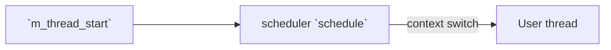
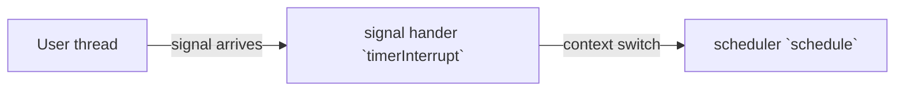
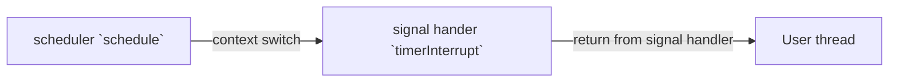
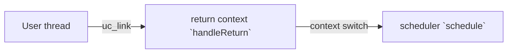

# `m_thread`
A simple M:1 preemptive scheduler

'M' means multiple user created thread, '1' means one system thread. `m_thread` multiplexes single system thread to 
run multiple user created threads concurrently.

`m_thread` is not thread(pthread) safe, it shall be run in single system thread only 

## Usage
- `#include "mthread.h"`
- First, use `m_thread_create()` to create a thread, at this point the thread won't start automatically
- After all the threads are created, call `m_thread_start()` to start the scheduler. This function will block until all 
threads return
- Threads are allowed to call `m_thread_create()` to add new threads during the execution, new threads will be executed
later automatically

## Examples
- `main`: `make main`
- `pingpong`: `make pingpong`

## How it implements
`m_thread` is implemented by utilizing functions in `ucontext.h` to perform context switch, and using `setitimer` 
and `sigaction` to generate a periodical signal, the signal handler context switches back to scheduler, implementing
preemptive scheduling.

## Execution diagram

On start:

During user thread execution, timer interrupt:

User thread resumes from timer interrupt: 

User thread returns:

