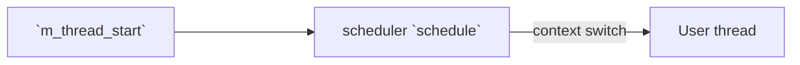
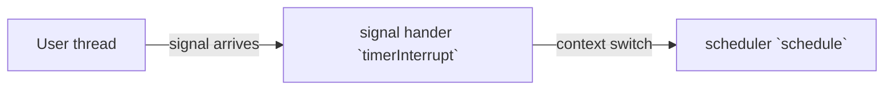
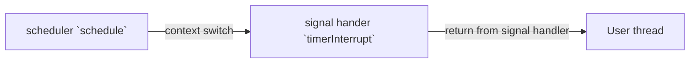
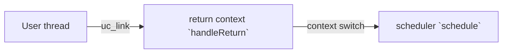

# `m_thread`
A simple M:1 preemptive thread implementation

'M' means multiple user created thread, '1' means one system thread. `m_thread` multiplexes single system thread to 
run multiple user created threads concurrently.

`m_thread` is not thread(pthread) safe, it shall be run in single system thread only 

## Usage
- `#include "m_thread.h"`
- First, use `m_thread_create()` to create a thread, at this point the thread won't start automatically
- After all the threads are created, call `m_thread_start()` to start the scheduler. This function will block until all 
threads return
- Threads are allowed to call `m_thread_create()` to add new threads during the execution, new threads will be executed
later automatically
- Threads can call `m_thread_yield()` if they want to give up the CPU
- Threads can call `m_thread_self()` to get its thread id, just like `pthread_self()`
- Sleep-related actions shall be done via `m_thread_sleep()` and `m_thread_usleep()`

## Examples
- `main`: `make main`
- `pingpong`: `make pingpong`

## How it works
`m_thread` is implemented by utilizing functions in `ucontext.h` to perform context switch (which are NOT async signal 
safe, see descriptions below), `sigaction` to install signal handler, and using `timer_settime` to generate a 
periodical signal. Signal handler will context switches back to scheduler, implementing preemptive scheduling.
When user thread returns, it will enter a special context *return context*, which performs thread removal, resource 
deallocation, and finally, switch back to scheduler.

## Execution diagram

On start:

During user thread execution, timer interrupt:

User thread resumes from timer interrupt: 

User thread returns:

## Tackling issues about async signal safe
`m_malloc` have tried the following ways to tackle the problem that functions in `ucontext.h` are not async signal
safe:
- Only user threads can be interrupted. Both scheduler, signal handler and *return context* block signal, so it is safe
to use those functions there
  - Return from signal handler (back to user thread) is handled by kernel, there is no need to worry about it.
  - When switching from scheduler to user thread, `swapcontext()` may unblock signal **before** it restores user 
  context, if the interruption happens exactly after it, the user thread context is corrupted when switching back to 
  scheduler
  - When user thread returns, it will eventually call `setcontext()` to switch to scheduler, this might be problematic,
  though it is OK in x86_64 since the implementation blocks the signal first
- To make `swapcontext()` and `setcontext()` safe, we need some ways to detect whether we interrupted them, by:
  1. Get the original program counter when the interruption happened, this is done by interpreting the third argument 
  `void *ucontext` of the signal handler, implemented in `getInterruptIP()`. 
  **This is architecture specific, only i386 and x86_64 are implemented here.**
  2. Compare it with the address range of these functions. We cannot easily get the exact size of a function in C, so we 
  just assumed it is `1024`
- If interruption happened during them, the signal handler will directly return
  
